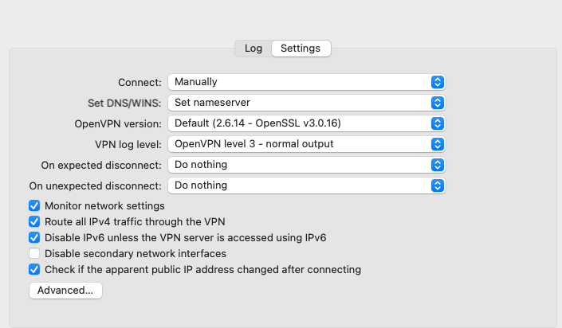

# OpenVPN / Tunnelblick
This is a backup to our Proton VPN service for use by the development team only.
This service is hosted and managed by Mythic Beasts using OpenVPN and requires the use of [Tunnelblick](https://tunnelblick.net/).

## Installation 
Installation is via Homebrew:

`brew install --cask tunnelblick`

## Configuration
The OpenVPN licences are created and distributed by the hosting team, they will provide you with a `.ovpn` file.
* Import this file into Tunnelblick by double clicking it. When prompted select to install for 'Only Me'.
* Open Tunnnelblick (either via Alfred and searching for Tunnelblick or via the application bar icon and selecting `VPN details`).
* Under configurations ensure the following are set:

## Connection
To connect to the VPN simply select the Tunnelblick icon in the application bar and select `Connect <configuration name>`.
eg: `connect sjones`

