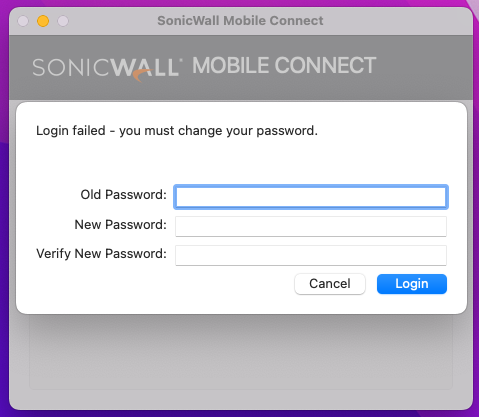

# Accessing VPN

We use SonicWall Mobile Connect for VPN connectivity software to the office network. This is essential for deployments 
and access to some IP protected websites (e.g. staging sites). This requires the Support team creating your user on the 
Sonicwall firewall.

> [!IMPORTANT]  
> Please note the VPN software won't work if you are in the office (since you're already on the office network).

## Installation
This is installed by default to all devices via Addigy as part of the initial Mac setup. 

## Setup
1. Open the app, this can be found via Alfred by searching for `sonicwall`
2. Click add connection, and you should be prompted to enter the details for your new connection.

Enter the details as:

* **Name:** Studio 24 VPN
* **Server:** `vpn.studio24.net`

You will then be prompted to complete the rest of the information, as below:

* **Name:** Studio 24 VPN
* **Server:** `vpn.studio24.net`
* **Username:** as supplied by the support team
* **Password:** as supplied by the support team
* **Domain:** Studio24
* **Protocol:** Auto

Try connecting to test this works. 

## Resetting your password

The Support Team may set a temporary password and ask you to reset your VPN login password. A reset password screen will appear when you try to connect (see below). Please create a secure password and store this in your personal vault in 1Password.  

## Usage
1. Open the app, this can be found via Alfred by searching for `sonicwall`
2. Click `Connect`

You can keep Sonicwall Mobile Connect in your dock if you want to make this easy to find.

* Open the app, this can be found via Alfred by searching for `sonicwall`
* Right click the app
* Options -> Keep in dock

